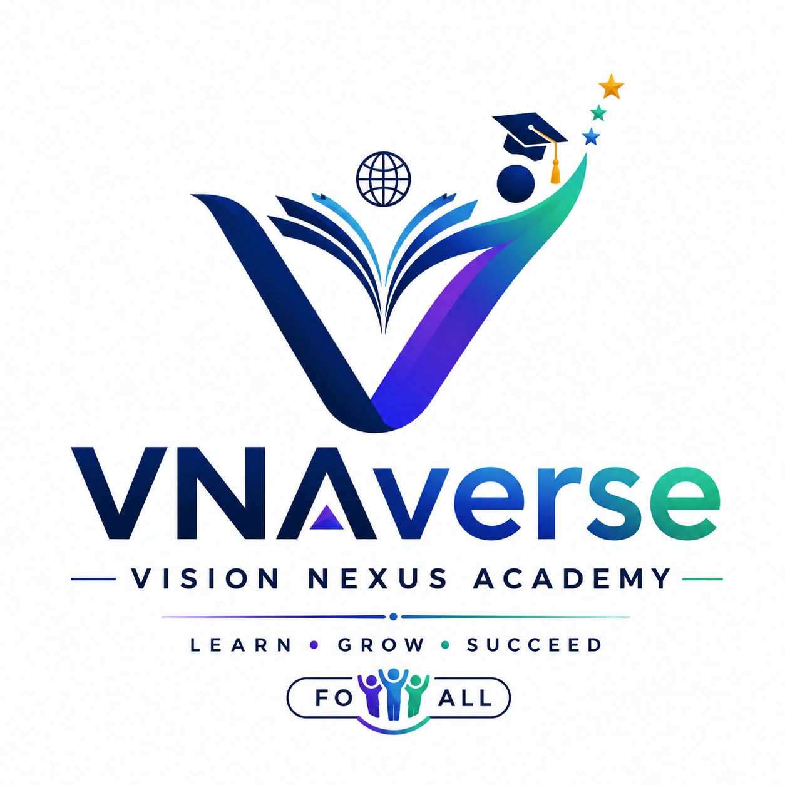

<p align="center">
  
</p>

<h1 align="center">VNAverse</h1>

<p align="center">
  <strong>Vision Nexus Academy</strong>
</p>

<p align="center">
  <i>Where Vision Meets Knowledge</i>
</p>

<p align="center">

AI-Powered Learning Ecosystem for Personalized Education

</p>

<p align="center">


</p>

---

# 🚀 About VNAverse

**VNAverse (Vision Nexus Academy)** is an AI-powered learning ecosystem built to transform how students prepare for competitive examinations and develop real-world skills.

Rather than being just another question practice platform, VNAverse focuses on creating a personalized learning experience through intelligent recommendations, performance analytics, adaptive learning, and AI-powered education.

The first flagship product of VNAverse is designed for **Government Exam Preparation**, helping students practice smarter, monitor progress, and continuously improve.

---

# ✨ Vision

> **Where Vision Meets Knowledge**

Our mission is to build an intelligent education platform that empowers every learner to unlock their full potential through technology, data, and artificial intelligence.

We believe education should be:

- Personalized
- Intelligent
- Accessible
- Scalable
- Affordable

---

# 🌟 Current Features

## 👨‍🎓 Student Module

- 🔐 Secure JWT Authentication
- 👤 User Profile Management
- 🏠 Personalized Dashboard
- 📚 Practice Questions
- 📝 Mock Test System
- 📄 Previous Year Papers
- 📈 Performance Analytics
- 🤖 AI Tutor
- 📱 Fully Responsive UI

---

## 👨‍💼 Admin Module

- 👥 User Management
- 📊 Admin Dashboard
- ❓ Question Management
- 📄 Previous Year Paper Management
- 📝 Mock Test Management
- 📂 CSV Bulk Upload
- 📈 Analytics Dashboard

---

# 💻 Technology Stack

## Frontend

- React
- Vite
- Bootstrap 5
- React Router
- Axios
- Chart.js
- Lucide React

---

## Backend

- Node.js
- Express.js
- MongoDB Atlas
- Mongoose
- JWT Authentication
- bcryptjs
- Multer
- Google Gemini API

---

# 🏗 System Architecture

```text
                   React + Vite
                        │
                        │ Axios
                        ▼
                 Express REST API
                        │
        ┌───────────────┼───────────────┐
        ▼               ▼               ▼
 MongoDB Atlas     Gemini AI      File Storage
```

---

# 📂 Project Structure

```text
VNAverse
│
├── backend
│   ├── controllers
│   ├── middleware
│   ├── models
│   ├── routes
│   ├── uploads
│   ├── utils
│   ├── server.js
│   └── package.json
│
├── frontend
│   ├── public
│   ├── src
│   │   ├── assets
│   │   ├── components
│   │   ├── hooks
│   │   ├── layouts
│   │   ├── pages
│   │   ├── services
│   │   ├── styles
│   │   ├── utils
│   │   └── App.jsx
│   └── package.json
│
├── docs
├── README.md
└── .gitignore
```

---

# 📸 Screenshots

> Screenshots will be added after the Beta launch.

- Landing Page
- Student Dashboard
- Admin Dashboard
- Mock Tests
- Previous Year Papers
- Analytics

---

# ⚙️ Installation

## Clone Repository

```bash
git clone https://github.com/Aditya99977/VNAverse.git

cd VNAverse
```

---

## Backend

```bash
cd backend

npm install

npm run dev
```

Runs on

```
http://localhost:5000
```

---

## Frontend

```bash
cd frontend

npm install

npm run dev
```

Runs on

```
http://localhost:5173
```

---

# 🌐 Live Demo

🚧 Coming Soon

Frontend

```
Coming Soon
```

Backend

```
Coming Soon
```

---

# 📚 Current Modules

## Authentication

- User Registration
- Login
- JWT Authentication
- Protected Routes

---

## Student

- Dashboard
- Practice Questions
- Mock Tests
- Previous Year Papers
- Performance Analytics
- AI Tutor

---

## Admin

- Admin Dashboard
- User Management
- Question Management
- Mock Tests
- Previous Year Papers
- CSV Upload
- Analytics

---

# 🚀 Development Progress

## ✅ Completed

- Project Setup
- Authentication System
- Student Dashboard
- Admin Dashboard
- Practice Module
- Mock Test Module
- Previous Year Papers
- Performance Analytics
- AI Tutor
- Responsive UI
- Security Improvements
- Architecture Improvements

---

## 🚧 Currently Building

- Personalized Learning System
- Exam-based Recommendations
- Personalized Dashboard
- Exam Analytics

---

## 🔮 Future Roadmap

- AI Study Planner
- AI Performance Insights
- Smart Subject Recommendations
- Personalized Learning Paths
- Daily Goals
- Notifications
- Leaderboards
- Premium Membership
- Resume Builder
- Interview Preparation
- Mobile Application
- Subscription Platform
- Multi-language Support
- Public Beta Launch

---

# 💡 Why VNAverse?

Unlike traditional learning platforms that only provide study material, VNAverse aims to become an intelligent education ecosystem.

Future capabilities include:

- Personalized Learning
- AI Recommendations
- Adaptive Mock Tests
- Exam-specific Analytics
- Smart Performance Tracking
- Intelligent Study Planning

---

# 📖 Documentation

The **docs/** directory contains:

- Daily Development Logs
- Architecture Notes
- Roadmaps
- Feature Planning
- Technical Documentation

---

# 🤝 Contributing

Contributions, ideas, and feedback are always welcome.

If you'd like to contribute:

1. Fork the repository
2. Create a feature branch
3. Commit your changes
4. Push to your branch
5. Open a Pull Request

---

# 👨‍💻 Developer

## Aditya Thakur

Building **VNAverse** one day at a time.

### Connect With Me

**GitHub**

https://github.com/Aditya99977

**LinkedIn**

https://www.linkedin.com/in/aditya-thakur-67745141a/

---

# 📄 License

This project is currently under development as a startup and portfolio project.

Future licensing details will be updated as the platform evolves.

---

<p align="center">

⭐ If you like VNAverse, don't forget to star this repository!

</p>

<p align="center">

<b>Learn • Grow • Succeed</b>

</p>